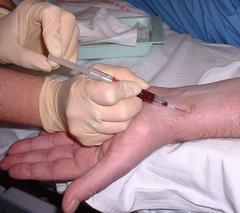
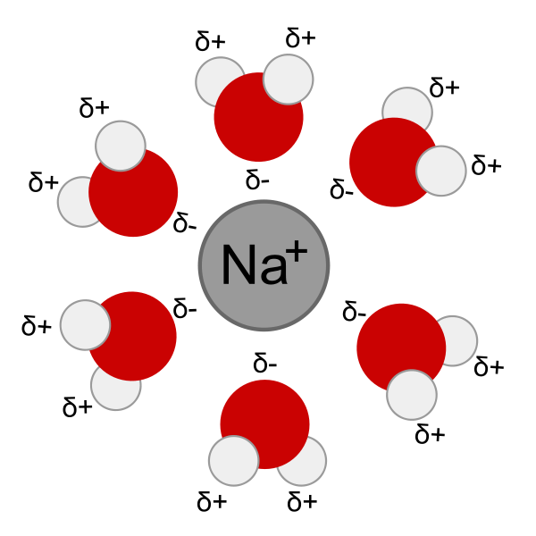
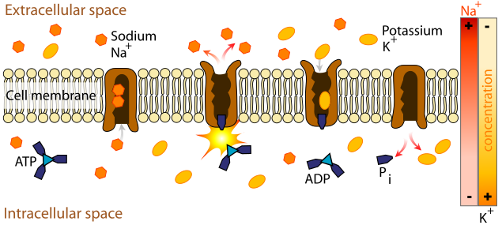
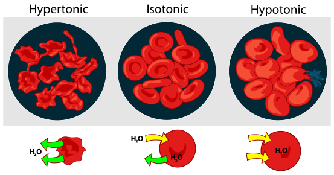
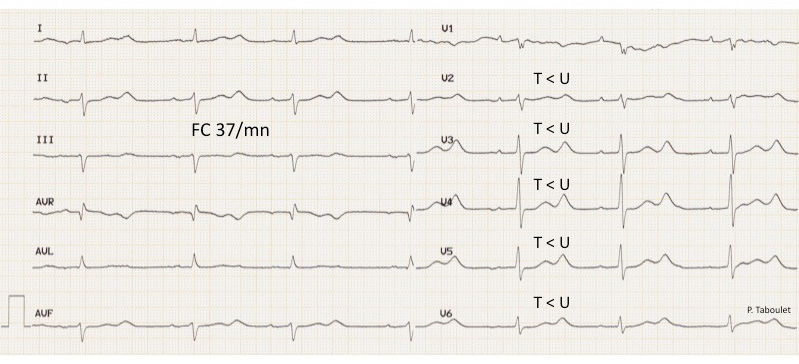

Equlibre Acide - Base
========================================================
author: Dr JC Bartier
autosize: true

jeanclaude.bartier@gmail.com

Pôle Anesthésie-Réanimation SAMU-SMUR-CESU

date: 10/11/2014

PLAN: Acide-base
========================================================

- Introduction
- Rappels Physio-Pahologiques
- Les principales anomalies Acido-basiques
  - Acidose respiratoire
  - Acidose métabolique
  - Alcalose métabolique
  - Alcalose respiratoire

Les troubles de l'équilibre acide-base (TAB)
========================================================
incremental: true

- Ce sont des **anomalies biologiques** qui accompagnent tous les *dysfonctionnements aigus* des grandes fonctions vitales.
- Leur mise en évidence nécessite un examen sanguin spécifique appelé **gaz du sang**
- les signes cliniques sont ceux de la **maladie causale** (ex. acidose métabolique et arrêt cadio-respiratoire)
- Le traitement est avant tout celui de la cause initiale.

Physio-pathologie
========================================================
incremental: true

- Le système acido-basique le plus simple est le verre d'eau
- Arrhenius (1887) définit un **acide** une substance qui produit des ions $H^+$
- Une solution est acide lorsque le nombre d'**ions $H^+$ > nombre d'ions $OH^-$**
- $H_2O \rightleftharpoons H^+ + OH^-$
- à 37°C il y a **$0,00000004$** meq ion $H^+$ par litre de plasma (contre 140 meq de $Na^+$)

Notion de Potentiel Hydrogène (pH)
========================================================
incremental: true

- à $37°C$ il y a **$0,00000004$** meq ion $H^+$ par litre de plasma 

- $Log(0.0000000004) =  -7.39794$

- $Log(\frac{1}{0.00000004}) = 7.39794$

- Finalement **$pH = 7,4$**

- Fourchette de normalité: **$7,38 - 7,42$**

- Fourchette compatible avec la vie: **6,8 à 7,8**

En pratique
=========================================================
incremental: true

- Si la $[H^+]$ **augmente** le **pH diminue**
  - on parle d'**acidose** ($pH < 7,38$)
  
- Si la $[H^+]$ **diminue** le **pH augmente**
  - on parle d'**alcalose** ($pH > 7,42$)
  
Origine des ions Hydrogène
==========================================================
incremental: true

- **Respiratoire**
  - $O_2 + Glucose -> CO_2 + H_2O + 38 ATP$ (Krebs)
  - $CO_2 + H_2O <-> H_2CO_3 <-> H^+ + HCO_3^-$
  - élimination pulmonaire (rapide)
- **Métabolique**
  - protéines -> proteines^- + $H^+$
  - élimination rénale (lente)
- métabolisme **anaérobie** (ACR, Choc)
  - $Glucose -> CO_2 + H_2O + 2 ATP +$ **acide lactique**
  - acide lactique <-> $lactates^- + H^+$

Les gaz du sang (technique)
=========================================================

__REGLEMENTATION__

Décret du 29 juillet 2004 ,article 4311.7
36ème alinéa
« L'infirmière est habilitée à accomplir sur prescription médicale écrite quantitative et qualitative, datée et signée, les actes et soins infirmiers suivants, à condition qu'un médecin puisse intervenir à tout moment :...Prélèvement de sang artériel pour gazométrie ... »

Les gaz du sang (technique 2)
=========================================================
incremental: true

- on prélève du sang **artériel** 

  - acte **douloureux** (EMLA)
  - artère radiale (+ test d'Allen)
  - éliminer soigneusement les **bulles d'air**
  - fermeture **hermétique** du tube
  - conservation sur **glace**

Les gaz du sang (résultats)
=========================================================
incremental: true

Paramètre | Commentaire | Valeur normale  
----------|------------ |---------------
$pH$      | acidité/alcanilité | $7,4 \pm 2$
$PaCO_2$  | composante respiratoire | $40 \pm 2$ mmHg
$bicarbonates$ | composante métabolique | $24 \pm 2$ meq/l

- ionogramme  

Paramètre | Commentaire | Valeur normale  
----------|------------ |---------------  
$sodium$  | hydratation | $140 \pm 2 meq/l$
$potasium$ | tr.du rythme | $3,5 \pm 0,5 meq/l$
$chlore$ | TAB | $105 \pm 2 meq/l$

<!-- $PaO_2$   | oxygénation | $100$ mmHg -->

En pratique
=========================================================
incremental: true

 | Respiratoire | Métabolique | pH
---|--------------|-------------|------
Acidose | pCO2 augmentée | bicarbonates diminués | pH < 7.38  
Alcalose | PaCO2 diminuée | bicarbonates augmentés| pH > 7.42

Acidose respiratoire
=========================================================
incremental: true

- défaut d'élimination du CO2
- ex: décompensation respiratoire d'une BPCO
- Toutes les IRA (OAP, pneumopathies hypoxémiantes, etc.)

Acidose métabolique
=========================================================
incremental: true

- accumulation d'**acides non volatiles**

    - acide lactique: ACR, états de choc
    - acido-cétose diabétique
    - insuffisance rénale chronique
    
- **pertes de bicarbonates**
  - diarrhées profuses (choléra)

- signes associés
  - hyperventilation (dyspnée de Kussmaul)
  
Les solutés alcalins
=========================================================
incremental: true

- sont proposés dans le traitement **symptomatique** de l'acidose métabolique
- usage contreversé
- ne remplace jamais le traitement étiologique
- le plus utilisé: **bicarbonate de sodium**
  - 3 présentations
  - la forme à 8.4 % est utilisée dans les états de choc
  - se perfuse normalement sur un KT central
  - incompatibilité chimique avec les catecholamines (adrénaline)

Alcalose métabolique
=========================================================
incremental: true

- pertes importantes d'acide
  - vomissements
  - aspiration gastrique
  
Alcalose respiratoire
=========================================================
incremental: true

- mécanisme = hyperventilation
- psychogène (crise de tétanie)
- erreur de réglage du respirateur
- intoxications
  - acide acetyl salycilique
  
Questions ?
=========================================================
type: section

Anomalies hydro-electrolytiques
=========================================================
type: section

Plan
====
- Physio-pathologie
  - définitions, notion de compartiments, l'eau dans l'organisme
  - comment se font les échanges ?
  - électrolytes, ions, osmolarité, natrémie
  - déshydratation et hyperhydratation
  - anomalies du potassium
  - cas cliniques

Définitions
===========
incremental: true

- solution = soluté + solvant
- Un __solvant__ est une substance liquide qui a la propriété de dissoudre, de diluer ou d'extraire d’autres substances sans les modifier chimiquement et sans lui-même se modifier. L'__eau__ est le solvant le plus courant, la solution étant alors qualifiée de solution aqueuse.
- le __soluté__ est ce qui est dissous dans le solvant.
- l'eau est un solvant indispensable à la vie.

Compartiments
=============
incremental: true

- l'eau de l'organisme se répartit dans différents secteurs appelés __compartiments__ ou __secteurs__.
- il y a 2 compartiments majeurs:
  - compartiment __extra-cellulaire__ où le _soluté_ majeur est le __sodium__ (__Na__trium)
  - compartiment __intra-cellulaire__ où le _soluté_ majeur est le __potassium__ (__K__alium)
- les échanges d'eau se font au travers de __membranes cellulaires__ par un phénomène appelé __osmose__.

eau
===

Le sodium (NA)
================

- Les mouvements de l'eau dans l'organisme sont étroitement liés à ceux du __sodium__
- l'ion sodium est toujours entouré d'une "sphère" d'eau qu'il entraîne avec lui au cours de ses déplacements.

---  

Membrane cellulaire
===================
incremental: true

- Ce sont des membranes __semi-perméables__ : leur perméabilité est différente selon qu'il s'agisse du _solvant_ ou du _soluté_.
- La membrane cellulaire expulse activement le NA en échange de K par l'intermédiaire de pompes fonctionnant avec de l'ATP.
- Cette inégalité de répartition des solutés de part et d'autre de la membrane cellulaire est responsable du phénomène d'__osmose__.
- On appelle __concentration__ le rapport _solutés_ / volume du _compartiment_ (C = x g/l).
- __L'eau se déplace toujours du compartiment le moins concentré vers le compartiment le plus concentré__.

Membane semi-perméable (1)
======================

Membane semi-perméable (2)
======================

Tonicité
========
incremental: true

- si les 2 compartiments sont à la même concentration, ils sont dits __isotoniques__.
- si le compartiment __1__ est plus concentré que le compartiment __2__:
  - le compartiment 1 est dit __hyper__tonique
  - le compartiment 2 est dit __hypo__tonique
- l'eau va se déplacer du compartiment 2 vers le compartiment 1, jusqu'à ce que les concentrations des deux compartiments soient égales.
- Application __hémolyse__.

Hémolyse
========

- Hémo = sang, lyse = destruction
- L'eau pure (eau ppi) est hypotonique.

Les solutés
===========
- protéines (albumine)
- sucres (glucose)
- urée
- (alcool)
- électrolytes (ionogramme)
  - Sodium
  - Potassium
  - Chlore
  - Calcium
  - Magnésium
  - Bicarbonates
  - Lactates
  - Phosphate

Les électrolytes
================
incremental: true

- Substances se dissociant dans le solvant en particules chargées électriquement appelées __ions__.
- $NaCl$ (sel de table) $\rightleftharpoons$ $Na^+ + OH^-$

- Valeurs normales de quelques électrolytes de l'ionogramme sanguin 

ion  | mEq/l | 	mmol/l
-----|-------:|--------:  
Sodium 	| 135 à 145 mEq/l |	135 à 145 mmol/l  
Potassium  |	3,5 à 5 mEq/l |	3,5 à 5 mmol
Chlore |	95 à 105 mEq/l |	95 à 105 mmol/l
Bicarbonates |	22 à 30 mEq/l |	22 à 30 mmol
Calcium |	90 à 100 mg/l |	2,25 à 2,5 mmol

Osmolarité
==========
incremental: true

- c'est une mesure du nombre de particules dissoutes dans le plasma
- unité = __osmoles__ ou milliosmoles (mosm) par litre.
- valeur normale: __300 mosm/l__ (295 - 305)
- Tout soluté de perfusion ayant la même osmolarité est __isotonique__ :
  - sérum glucosé à 5%
  - sérum salé à 0,9% (sérum physiologique)
- Solutés __hypertoniques__ (risques de nécrosescutanées)
  - bicarbonate de sodium à 8,4 %
  - sérum glucosé à 30%

Le sodium
===================

- C'est lui qui indique l'état d'hydratation
- __hypernatrémie__ = déshydratation
- __hyponatrémie__ = hyperhydratation

Tableaux Cliniques
=========================================================
type: section

Deshydratation globale
======================
incremental: true

- mécanisme: perte d'eau 
- compensation par le secteur intra-cellulaire
- résultat: deshydratation mixte
- survie sans eau: quelques jours (max = 1 semaine)
- Evolution:
  - insuffisance rénale
  - choc hypovolémique
  - arrêt cardiaque par désamorçage cardiaque
  - chez le nourrisson le décès survient après une perte de 10% de son poids en eau ($\approx 1 kg$)

Où perd t'on de l'eau ?
=======================
incremental: true

- Perte sanguine
  - sang total: hémorragie (50% masse sanguine)
- Pertes digestives
  - vomissements, diarrhées
  - SNG, fistules
- Pertes cutanées
  - sueurs (mines, tenues NRBC, coup de chaleur)
  - plasma: brûlure étendue (mortalité précoce)
- Pertes rénales
  - hyperglycémie
  - diabète insipide
- Troisième secteur
  - péritonite, pancréatite, occlusion

Signes de déshydratation
=========================
incremental: true

- soif intense (agitation)
- perte de poids
- somnolence, confusion
- pli cutanné (front, manubrium sternal)
- sécheresse des muqueuses
- constantes
  - tachycardie
  - hypotension
  - hyperthermie
  - oligoanurie

- __Attention__ aux âges extrèmes de la vie et aux patients qui ne s'expriment pas (Démence sénile, réanimation, psychiatrie, AVC)

Signes de déshydratation (2)
=========================
- biologie:
  - __hypernatrémie__: Na > 145 meq/l
  - hyperosmolarité > 300 osm/l
  - hématocrite élevé

Traitement de la déshydratation
==============================
incremental: true

__symptomatique__
- Urgence (collapsus): remlissage massif: objectif PA > 80 mmHg (maromolécules)
- sérum salé
- sinon favoriser la __voie orale__ (eau gélifiée)

__étiologique__
- transfusion
- apport d'électrolytes

Hyperhydratation
==================
incremental: true
- mécanisme
  - apports massifs de solutés hypotoniques, rétention d'eau de de sel
  - exemple: __insuffisance cardiaque__
  - dilution du secteur extracellulaire
  - transfert d'eau vers le secteur intracellulaire
  - oedèmes tisulaires

Hyperhydratation: signes
=======================
incremental: true

- __prise de poids__
- __oedèmes__
- __dégout de l'eau__
- signe neurologiques: crampes, céphalées, convulsions
- biologie:
  - __hyponatrémie__

Hyperhydratation: traitement
==================
- __restriction hydrique__
- diurétiques
- épuration extra-rénale dans les formes graves.

Hyperkaliémie
=============
incremental: true

- $K^+ > 4,5 mmol/l$
- complication majeure: __ACR en FV__
- ECG: ondes T amples et symétriques
- Traitement
  - stopper les apports de potassium (Ringer)
  - résine échangeuses (Kayexalate)
  - diurétique rapide (furosémide)
  - bicarbonate de sodium
  - Glucose + insuline
  - Epuration extra-rénale
  
Hyperkaliémie (ECG)
=============

source: http://www.wikiwand.com/fr/Hyperkali%C3%A9mie

Hypokaliémie
============
incremental: true

- $K^+ < 3,5 mmol/l$
- clinique pauvre: crampes
- ECG: apparition d'une onde U
- traitement
  - pas urgent: __PO__
  - urgent: __Jamais de potassium en IVD__
    - max. 1,5 g de K/heure au PSE

Hypokaliémie (ECG)
====

source: http://www.e-cardiogram.com/ecg-banque.php?idcat=8&idscat=62&PHPSESSID=b1023999db1f48b9a3af5ca207ac2154

Cas Cliniques
=========================================================
type: section

Syndrome des buveurs de bière
=============================
incremental: true

H 50 ans amené par ambulance pour crise convulsive inaugurale. A l'examen, le patient est confus, et présente un tremblement au repos. Connu pour être un buveur de bière (plus de 5 litres par jour). En dehors d'une hépatomégalie, l'examen clinique est normal.  

- temp: 36 °C 
- PA: 120/70  mmHg
- fc: 90

Syndrome des buveurs de bière
=============================
incremental: true

Une gazométrie et un ionogramme sont prélevés:  

- sodium: 110 mmoles/L
- potassium: 2,5 mmols/L
- chlore: 90 mmoles/L
- glycémie: 5,5 mmoles/L
- pH: 7,5
- bicarbonates: 30 mmoles/L
- pCO2: 39.55 mmHg

Le patient est-il deshydraté, hyperhydraté, en alcalose respiratoire ou métabolique ?

Même le coca-cola (sans sucre) est dangereux!
=============================================
incremental: true

Une femme de __54 ans__ est admise pour un __état de mal convulsif__. Ce n'est pas une épileptique connue, mais elle est traitée pour dépression et éthylisme. Il n'y a pas de sevrage brutal de l'alcool. Son mari signale la prise de  __9 litres__ de coca sans sucre dans la journée. Les crises convulsives sont stoppées par 10 mg de diazépam IV.  
Le bilan biologique est le suivant:

- natrémie: 109 mmoles/L
- osmolarité: 232 mOsm/L

Comment peut-on expliquer ce qui s'est passé ? Les troubles neurologiques sont-ils dus à une deshydratation, une hyperhydratation, à un élément toxique du coca-cola (eau, aspartame 550 mg, cola, caféine) ?

Une diarrhée de fou
===================
Un homme de 88 ans, dément sénile est admis pour une diarrhée liquide évoluant depuis 48 heures. Il est habituellement traité par Risperdal, théralène et sectral (pour une HTA).  
A l'admission, il est faiblement réactif, dyspnéique avec une langue rotie.
Sa pression artérielle est à 80/60 mmHg (normale 150/90), la fréquence cardiaque est à 95 c/mn, la fréquence respiratoire est à 28 c/mn.

Une diarrhée de fou
===================
Le bilan biologique est le suivant (gazométrie artérielle prélevée sous O2):

- glucose: 7.2 mmoles/L
- sodium: 155
- potassium: 5.8
- chlore: 110
- urée: 15
- créatinine: 186
- calcium 2.07
- osmolarité: 320

---

- pH: 731
- pCO2: 2.6 kPa (19.5 mmHg)
- pO2: 17 kPa (127 mmHg)
- bicarbnates: 10 mmoles/L
- saturation en O2: 98%

---
Quel es tle statut hydro-électolytique et acido-basique de ce patient? Quel traitement d'urgence ?

Mamie à eu chaud...
===================
C'est l'été 2006 et il fait très chaud. Paulette 86 ans est copieusement hydratée par son aide -ménagère comme le recommande la radio. Pourtant l'état général de Paulette se dégrade: une confusion temporo-spatiale s'aggarve , fait des fausses reconnaissances, refuse les boissons qui lui sont proposées. Un matin elle est retrouvée au sol, très confuse avec une hémipégie/parésie droite. Compte tenu de l'age et de l'absence de possibilités thérapeutiques, le médecin traitant en accord avec la famille décide de ne pas l'hospitaliser. Il prescrit cependant une prise de sang. Les résultats sont les suivants:

Mamie à eu chaud...
===================
- GR: 4.2 M/ml
- Hb: 13.1 g/dl
- Ht: 37.7%
- D-Dimères: 1740 ng/ml (N < 500)
- créatinine: 6.7 mg/L
- sodium: 116 mmoles/L
- potassium: 3.59 mmoles/L

Au vu de ces résultats une thérapeutique active est mise en place et Paulette récupère totalement. Comment expliquer ce qui s'est passé ?

soluté de réhydratation de l'OMS
=================================
L'organisation mondiale de la santé (OMS) recommande de réhydrater les enfants victimes de troubles digestifs sévères (choléra) à l'aide de la solution suivante (pour 1 litre d'eau propre):

- glucose: 75 mmol (soit 75 x 180g / 1000 = 13.5g) 
- sodium: 75 mmol (soit 140 mmoles de nacl = 58.5 x 140 / 1000 = 8.2)
- chlore: 65 mmol
- potassium: 20 mmol
- citrate: 10 mmol
soit au total 250 mosm/L  

Cette solution est hypotonique par rapport à l'osmolarité du plasma et très sucrée (respectivement 300 mOsm/L et 1g/L). Pouvez-vous expliquer pourquoi ?

Question subsidiaire (plus difficile):
======================================
Perdu(e) quelque part sur la planète et confronté à une épidémie de choléra, on vous propose une solution de réhydratation composé de 2.5 morceaux de sucre et une cuillerée à café de sel. Qu'en pensez vous ?
