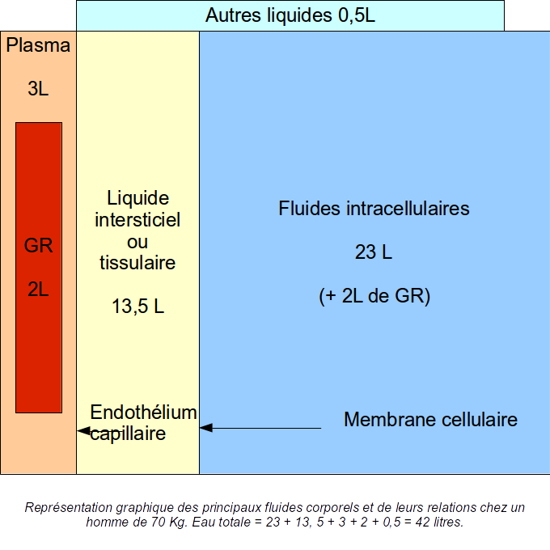

---
output:
  html_document:
    keep_md: yes
---

Physiologie de l'eau
========================================================

Plan
----
### On part de l'eau pure et de ses carctéristiques
- données générales
- l'eau et la vie
- strucucture de l'eau et notion de neutralité
  - notion de pH
  
### L'eau salée
- électrolytes et dissociation
- osmolarité et osmolalité
- pression osmotique
- membrane semi-perméable

### Les compartiments
- eau totale et compartiments
- mouvements de l'eau
- volémie et pression artérielle
- deshydratation et hyperhydratation
  - diagramme de Darrow et Yannet
- introduction à la pharmacologie
  - équations différentielles
  - solutés de remplissage
  
### Equilibre acide-base
- acides fixes et volatiles
- acidose et alcalose
- gazométrie artérielle
- pathologie

### Vie cellulaire
- la cellule monde autonome
- membrane cellulaire
  - les pompes membranaires
- la mitochondrie
  - cycle de Krebs
  - vieilllissement, cancer
  
### Le système circulatoire
- anatomie générale
- hémodynamiques et ses déterminants
- pathologie
  - maladies de la pompe: IDM
  - maladies du circuit: HTA, choc

### Le système respiratoire

Répartition des liquides
------------------------
### sujet idéal
- poids total: 70 kg 
- eau totale: 60% du poids total (et = 0.6P)
- eau extra-cellulaire: 15 litres (cec = 0.2P)
- eau intra-cellulaire: 25 litres (cic = 0.4P)
- plasma: 2.5 litres (pl = 0.035P) constitué à 93% d'eau (epl = 0.93*pl)




```{r, echo=FALSE}
P<-70
et<-0.6*P
cic<-0.4*P
cec<-0.2*P
osm_normale<-300
osmoles_totales <- osm_normale * et
osmoles_ec<-osm_normale * cec
osmoles_ic<-osm_normale * cic
vec<-cec
vic<-cic

# diagramme de base
plot(0,xlim=c(-25,35),ylim=c(0,400),main="Diagramme de Darrow",xlab="Volume (litres)",ylab="Osmolarité",sub="Deshydratation globale")
abline(v=0)
abline(h=300,lty=2)
text(-10,390,"extra-cellulaire")
text(10,390,"intra-cellulaire")
# rect(-15,0,0,300,col="green",density=5)
# rect(0,0,25,300,col="yellow",density=5)

#rectanbles intra et extra cellulaires
rec<-rect(-vec, 0, 0, osm_normale, col="green", density=5)
ric<-rect(0, 0, vic, osm_normale, col="yellow", density=5)

# deshydratation
vec<-cec
vic<-cic

dp<--2
P<-P+dp
vec<-vec+dp
osm_ec<-osmoles_ec/vec
rec<-rect(-vec,0,0,osm_ec,border="blue")
# compensation
et<-vec+vic
osm_actuelle<-osmoles_totales/et
vic<-0.4*P
rect(-vec,0,vic,osm_actuelle,border="red")

P
et
cic
cec

```
Exemple d'hyperhydratation

```{r darrow_initial,echo=FALSE}
plot(0,xlim=c(-25,35),ylim=c(0,400),main="Diagramme de Darrow",xlab="Volume (litres)",ylab="Osmolarité")
abline(v=0)
abline(h=300,lty=2)
text(-10,350,"extra-cellulaire")
text(10,350,"intra-cellulaire")
rect(-15,0,0,300,col="green",density=5)
rect(0,0,25,300,col="yellow",density=5)
```
étape 1
```{r darrow_1,echo=FALSE}
plot(0,xlim=c(-25,35),ylim=c(0,400),main="Diagramme de Darrow",xlab="Volume (litres)",ylab="Osmolarité")
abline(v=0)
abline(h=300,lty=2)
text(-10,350,"extra-cellulaire")
text(10,350,"intra-cellulaire")
rect(-15,0,0,300,col="green",density=5)
rect(0,0,25,300,col="yellow",density=5)
rect(-25,0,0,180,border="red")
```
étape 2
```{r darrow_2,echo=FALSE}
plot(0,xlim=c(-25,35),ylim=c(0,400),main="Diagramme de Darrow",xlab="Volume (litres)",ylab="Osmolarité")
abline(v=0)
abline(h=300,lty=2)
text(-10,350,"extra-cellulaire")
text(10,350,"intra-cellulaire")
rect(-15,0,0,300,col="green",density=5)
rect(0,0,25,300,col="yellow",density=5)
rect(-18.75,0,31.25,240,border="blue")
```

