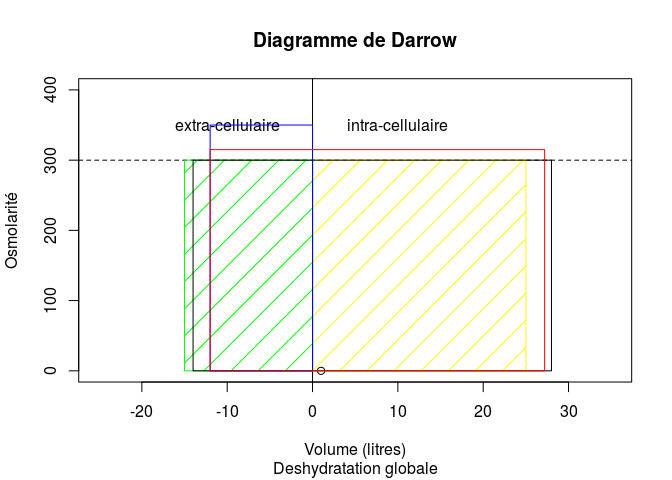
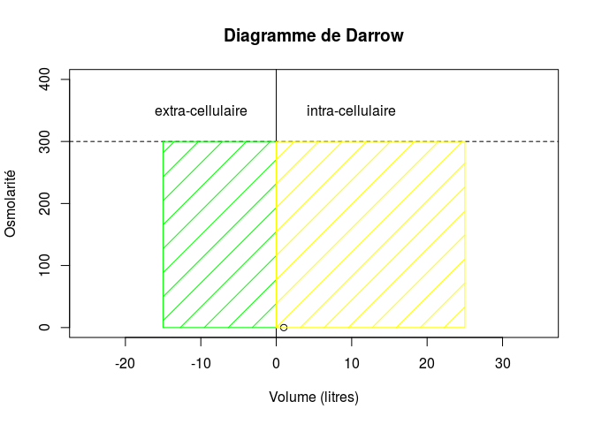
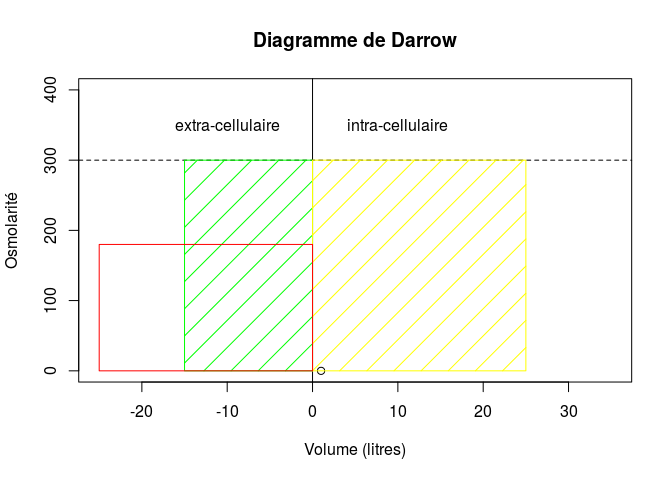
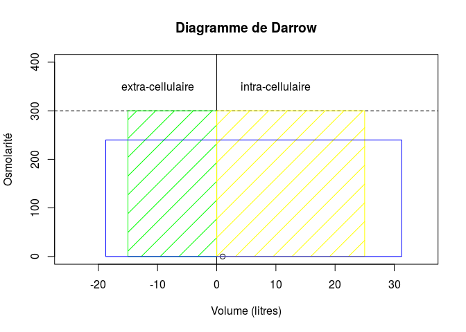

Physiologie de l'eau
========================================================

Plan
----
### On part de l'eau pure et de ses carctéristiques
- données générales
- l'eau et la vie
- strucucture de l'eau et notion de neutralité
  - notion de pH
  
### L'eau salée
- électrolytes et dissociation
- osmolarité et osmolalité
- pression osmotique
- membrane semi-perméable

### Les compartiments
- eau totale et compartiments
- mouvements de l'eau
- volémie et pression artérielle
- deshydratation et hyperhydratation
  - diagramme de Darrow et Yannet
- introduction à la pharmacologie
  - équations différentielles
  - solutés de remplissage
  
### Equilibre acide-base
- acides fixes et volatiles
- acidose et alcalose
- gazométrie artérielle
- pathologie

### Vie cellulaire
- la cellule monde autonome
- membrane cellulaire
  - les pompes membranaires
- la mitochondrie
  - cycle de Krebs
  - vieilllissement, cancer
  
### Le système circulatoire
- anatomie générale
- hémodynamiques et ses déterminants
- pathologie
  - maladies de la pompe: IDM
  - maladies du circuit: HTA, choc

### Le système respiratoire

Répartition des liquides
------------------------
### sujet idéal
- poids total: 70 kg 
- eau totale: 60% du poids total (et = 0.6P)
- eau extra-cellulaire: 15 litres (cec = 0.2P)
- eau intra-cellulaire: 25 litres (cic = 0.4P)
- plasma: 2.5 litres (pl = 0.035P) constitué à 93% d'eau (epl = 0.93*pl)


 

```
## [1] 68
```

```
## [1] 40
```

```
## [1] 28
```

```
## [1] 14
```
Exemple d'hyperhydratation

 
étape 1
 
étape 2
 

